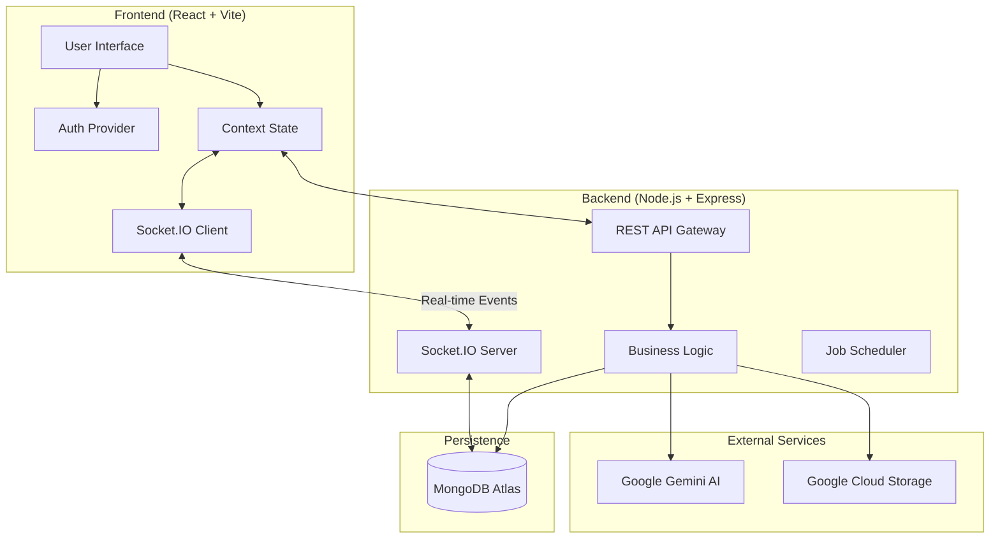

# Focus Ritual: AI-Powered Real-time LMS

**An enterprise-grade learning management platform engineered for flow state optimization.**
Focus Ritual integrates generative AI, real-time collaboration, and spaced repetition algorithms to transform passive study into active mastery.


## 🛠️ Tech Stack


## 🏗️ System Architecture



## 🚀 Key Engineering Features

*   ⚡ **Real-time State Synchronization:** Implemented a sub-100ms latency WebSocket architecture using **Socket.IO** to synchronize study rooms, chat, and collaborative timers across distributed clients.
*   🤖 **Generative AI Engine:** Leverages **Google Gemini Pro** via a custom proxy service to analyze PDF documents, automatically generate summary flashcards, and provide context-aware study coaching.
*   🔒 **Enterprise-Grade Security:** Features comprehensive **RBAC** (Role-Based Access Control), JWT-based stateless authentication, and secure file handling with **Google Cloud Storage** signed URLs.
*   🧠 **Spaced Repetition Algorithm:** Custom scheduling algorithm based on the SM-2 model to optimize memory retention intervals for flashcards.
*   📊 **Performance Analytics:** Aggregates user behavior data into visualized dashboards using complex MongoDB aggregation pipelines for deep insights.

## 🏁 Getting Started

Follow these steps to deploy the application locally.

### Prerequisites
*   Node.js v18+
*   MongoDB Instance (Local or Atlas)
*   Google Cloud Service Account (Storage & AI)

### Installation

1.  **Clone the repository**
    ```bash
    git clone https://github.com/yourusername/focus-ritual.git
    cd focus-ritual
    ```

2.  **Backend Setup**
    ```bash
    cd backend
    npm install
    # Create .env file from .env.example and add your credentials
    npm run dev
    ```

3.  **Frontend Setup**
    ```bash
    cd ../Focuss
    npm install
    npm run dev
    ```

4.  **Access the Application**
    Open `http://localhost:5173` to view the application. Use the **"Try Demo Account"** button on the login screen to explore immediately.